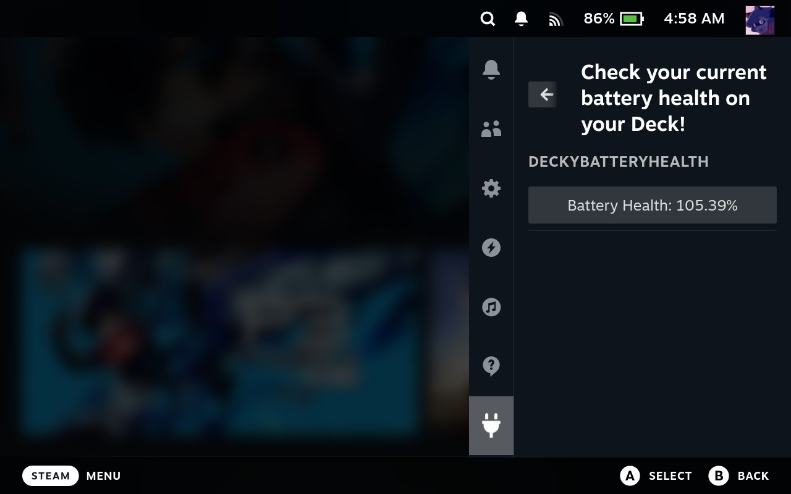

# Decky Battery Health Plugin for Steam Deck [](https://deckbrew.xyz/discord)

A very simple Decky Loader plugin that displays your Steam Deck’s battery health based on kernel stats from `/sys/class/power_supply/BAT1`.



---

## 🔋 Features

- Displays battery health as a percentage
- Reads directly from preinstalled `upower` binary
- Lightweight and simple UI
- Future plans:
  - Charge cycle count
  - Estimated wear and charge rate
  - Remaining time display
  - Warnings for poor health

---

## 🧩 Installation

### 📦 Decky Plugin Loader

1. Open desktop mode.
2. Download the latest release .zip and move it to Desktop or keep it in Downloads
3. Enable **Developer Mode** in Decky Loader (Quick Access → Decky → Settings ).
4. Click the **Developer** menu and install the latest release .zip file from there


### Distribution

We recommend following the instructions found in the [decky-plugin-database](https://github.com/SteamDeckHomebrew/decky-plugin-database) on how to get your plugin up on the plugin store. This is the best way to get your plugin in front of users.
You can also choose to do distribution via a zip file containing the needed files, if that zip file is uploaded to a URL it can then be downloaded and installed via decky-loader.

**NOTE: We do not currently have a method to install from a downloaded zip file in "game-mode" due to lack of a usable file-picking dialog.**

Layout of a plugin zip ready for distribution:
```
pluginname-v1.0.0.zip (version number is optional but recommended for users sake)
   |
   pluginname/ <directory>
   |  |  |
   |  |  bin/ <directory> (optional)
   |  |     |
   |  |     binary (optional)
   |  |
   |  dist/ <directory> [required]
   |      |
   |      index.js [required]
   | 
   package.json [required]
   plugin.json [required]
   main.py {required if you are using the python backend of decky-loader: serverAPI}
   README.md (optional but recommended)
   LICENSE(.md) [required, filename should be roughly similar, suffix not needed]
```

Note regarding licenses: Including a license is required for the plugin store if your chosen license requires the license to be included alongside usage of source-code/binaries!

Standard procedure for licenses is to have your chosen license at the top of the file, and to leave the original license for the plugin-template at the bottom. If this is not the case on submission to the plugin database, you will be asked to fix this discrepancy.

We cannot and will not distribute your plugin on the Plugin Store if it's license requires it's inclusion but you have not included a license to be re-distributed with your plugin in the root of your git repository.
